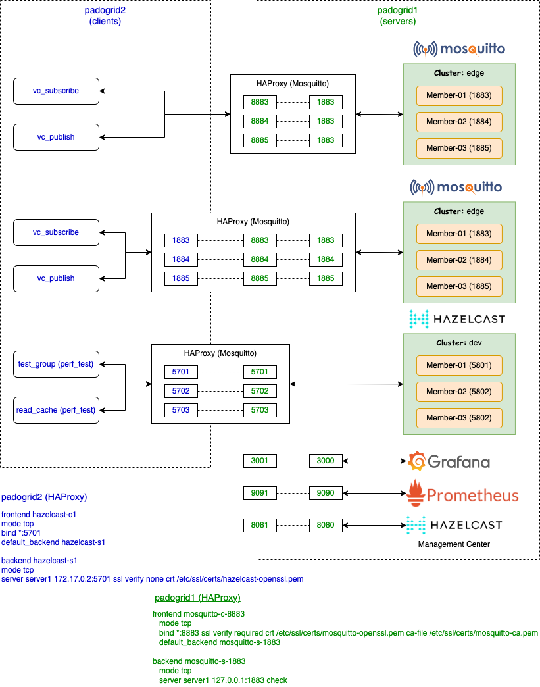

 [*PadoGrid*](https://github.com/padogrid) | [*Catalogs*](https://github.com/padogrid/catalog-bundles/blob/master/all-catalog.md) | [*Manual*](https://github.com/padogrid/padogrid/wiki) | [*FAQ*](https://github.com/padogrid/padogrid/wiki/faq) | [*Releases*](https://github.com/padogrid/padogrid/releases) | [*Templates*](https://github.com/padogrid/padogrid/wiki/Using-Bundle-Templates) | [*Pods*](https://github.com/padogrid/padogrid/wiki/Understanding-Padogrid-Pods) | [*Kubernetes*](https://github.com/padogrid/padogrid/wiki/Kubernetes) | [*Docker*](https://github.com/padogrid/padogrid/wiki/Docker) | [*Apps*](https://github.com/padogrid/padogrid/wiki/Apps) | [*Quick Start*](https://github.com/padogrid/padogrid/wiki/Quick-Start)

---

<!-- Platforms -->
[](https://github.com/padogrid/padogrid/wiki/Platform-PadoGrid-1.x) [](https://github.com/padogrid/padogrid/wiki/Platform-Docker)

# Configuring HAProxy for TLS Termination - Mosquitto, Grafana, Prometheus, Hazelcast Management Center

This bundle walks through steps involved in configuring a TLS termination proxy to secure Mosquitto, Grafana, Prometheus, and Hazelcast Management Center using HAProxy.

## Installing Bundle

```bash
install_bundle -download -workspace haproxy bundle-none-tutorial-docker-haproxy
```

## Use Case

HAProxy Community Edition is a free reverse proxy providing high availability and load balancing support for TCP and HTTP-based applications. HAProxy can also secure applications by terminating TLS traffic between client and server.

In this bundle, we walk through the steps involved in configuring a TLS termination proxy to secure Mosquitto, Grafana, Prometheus, and Hazelcast Management Center using HAProxy. Although Mosquitto natively supports TLS, we secure it via HAProxy to demonstrate how a wide variety of applications can be collectively secured.



## Required Software

- Docker
- PadoGrid 0.9.25+

### Directory Tree View

All of the files that you will be creating and modifying are provided in the `docker/haproxy` directory.

```bash
cd_docker haproxy
tree
```

Output:

```console
haproxy/
├── bin_sh
│   ├── generate_certs
│   └── setenv.sh
├── etc
│   └── pubsub.yaml
├── padogrid1
│   └── haproxy.cfg
└── padogrid2
    └── haproxy.cfg
```

## Data Flow

### Mosquitto

The diagram in the [Use Case](#use-case) section shows that the `padogrid1` container has a Mosquitto cluster taking on unencrypted TCP traffic on ports, 1883-1885. These ports are only accessible between containers and are not exposed to external applications. TLS termination is configured for ports, 8883-8885, which are in turn proxied to 1883-1885. The only ports that are exposed to the external applications are 8883-8885 secured by TLS.

The `padogrid2` container is used to run client applications that connect to the `padogrid1` clusters. The client applications can connect to Mosquitto cluster running on `padogrid2` either via the remote TLS ports, 8883-8885, or the local ports, 1883-1885. HAProxy is configured for the local ports, 1883-1885, to take on unencrypted TCP traffic to encrypt and forward it to the `padogrid1` ports, 8883-8885, which terminate TLS.

✏️  Note that the ports, 1883-1885, on `padogrid2` are not exposed to the external applications. This means, to connect to these ports, the client applications must run inside the container environment.

### Hazelcast

For Hazelcast, we configure HAProxy for uncrypted traffic as shown in the [Use Case](#use-case) diagram. 

The Hazelcast cluster cannot be configured with TLS termination due to its clients making direct, reverse connections to the cluster members. Upon initial connection, the Hazelcast client makes direct connections to individual members based on the member information internally received from the cluster. This means the proxy is only good for the initial connection. Thereafter, the member conenctions that the client must make are controlled by the cluster.

We configure HAProxy with unencrypted traffic, nontheless, to demonstrate the traffic flow. As with Mosquitto, the Hazelcast ports, 5701-5703 are not exposed to external applications. The clients must be running inside the container environment to access the Hazelcast cluster.

### Others

Grafana, Prometheus, and Hazelcast Management Center are web clients that will connect via HTTPS. Their TLS ports, 3001, 9091, and 8081, are exposed so that we can use the browser to securely access them.

## Startup Sequence

### 1. Start PadoGrid containers

#### 1.1. Start container - `padogrid1`

Let's start the first container named `padogrid1`.  We will use it to run Mosquitto and Hazelcast clusters along with the front end aplications, Grafana, Prometheus, and Hazelcast Management Center. HAProxy will be configured to proxy all but the Hazelcast cluster.

✏️ *This bundle requires PadoGrid Docker images built on Alpine, i.e., `padogrid/padogrid-base`.*

 Terminal (host OS)

```bash
docker run --name padogrid1 -h padogrid1 -d \
   --tmpfs /run \
   --mount type=volume,source=padogrid_haproxy,target=/opt/padogrid \
   -p 8883:8883 -p 8884:8884 -p 8885:8885 \
   -p 3001:3001 -p 9091:9091 -p 8081:8081 \
   padogrid/padogrid-base:latest
```

| Exposed TLS Ports | Unencrypted Ports |  For                        |
| ----------------- | ----------------- | --------------------------- |
| 8883-8885         | 1883-1885         | Mosquitto brokers           |
| 3001              | 3000              | Grafana                     |
| 9091              | 9090              | Prometheus                  |
| 8081              | 8080              | Hazelcast Management Center |

#### 1.2. Start container - `padogrid2`

Let's now launch the second container named `padogrid2`. We will use it for running clients that connect to the Mosquitto and Hazelcast clusters running on `padogrid1`.

 Terminal (host OS)

```bash
docker run --name padogrid2 -h padogrid2 -d \
   --tmpfs /run \
   --mount type=volume,source=padogrid_haproxy,target=/opt/padogrid \
   padogrid/padogrid:latest
```

---

### 2. Login to containers and install bundle

You can login to each container from your shell as follows. You will need three (3) terminals as shown below.

 Terminal (host OS)

```bash
# Terminal 1 (padogrid1)
docker exec -it padogrid1 /bin/bash
# Terminal 2 (padogrid1)
docker exec -it padogrid1 /bin/bash
# Terminal 1 (padogrid2)
docker exec -it padogrid2 /bin/bash
```

From one of the containers, install this bundle. Let's use Terminal 1 (`padogrid1`).

 Terminal 1 (`padogrid1`)

```bash
install_bundle -download -workspace haproxy bundle-none-tutorial-docker-haproxy
```

✏️  Note that `padogrid1` and `padogrid2` share the same volume such that the installed bundle is accessble both containers.

If you have logged in from the browser, then for your convenience, you can open this `README.md` file next to the terminals as follows.

- Select `/haproxy/` from the File Browser in the left pane.
- Double click on `README.md`.

✔️  Now, switch workspace to `haproxy` from each terminal. All of our work will be done in this workspace.

 Terminal 1 (`padogrid1`), Terminal 2 (`padogrid1`), Terminal 1 (`padogrid2`)

```bash
switch_workspace haproxy
```

---

### 3. Setup containers

‼️  **Section 3 must be done for both `padogrid1` and `padogrid2`**

Depending on how you installed HAProxy, you may need to enable its logging facility. If logging is not enabled, then follow the steps shown in this section to install `rsyslog` and configure HAProxy.

#### 3.1. Install syslog service

##### 3.1.1. Install `rsyslog`, `openrc`, `openssl`

 Terminal 1 (`padogrid1`), Terminal 1 (`padogrid2`)

```bash
sudo apk add rsyslog openrc openssl
```

##### 3.1.2. Create a new file, `/etc/rsyslog.d/haproxy.cfg`.

 Terminal 1 (`padogrid1`), Terminal 1 (`padogrid2`)

```bash
sudo mkdir /etc/rsyslog.d
sudo vi /etc/rsyslog.d/haproxy.cfg
```            

Add the following in `/etc/rsyslog.d/haproxy.conf` or `/etc/rsyslog.conf`:

 Terminal 1 (`padogrid1`), Terminal 1 (`padogrid2`)

```haproxy
# Collect log with UDP
$ModLoad imudp
$UDPServerAddress 127.0.0.1
$UDPServerRun 514

# Creating separate log files based on the severity
local0.* /var/log/haproxy-traffic.log
local0.notice /var/log/haproxy-admin.log
```

##### 3.1.3. Restart `rsyslog`

 Terminal 1 (`padogrid1`), Terminal 1 (`padogrid2`)

```bash
# First, initialize services. This needs to be done once.
sudo openrc sysinit 

# Restart rsyslog
sudo rc-service rsyslog restart
```

Output:

```console
 * Stopping rsyslog ...                                      [ ok ]
 * Starting rsyslog ...                                      [ ok ]
rsyslogd: imklog: cannot open kernel log (/proc/kmsg): Operation not permitted.
rsyslogd: activation of module imklog failed [v8.2306.0 try https://www.rsyslog.com/e/2145 ]                                                                            [ ok ]
```

If you see the `miklog` error message as shown in the output then comment it out as follows.

```bash
sudo sed -i '/imklog/s/^/#/' /etc/rsyslog.conf
```

If you commented out the `imklog` module by executing the above command, then you need to restart `rsyslog`.

```bash
sudo rc-service rsyslog restart
```

Output:

```console
 * Stopping rsyslog ...                                      [ ok ]
 * Starting rsyslog ...                                      [ ok ]
```

##### 3.1.4. Monitor log

 Terminal 1 (`padogrid1`) and Terminal 1 (`padogrid2`)

```bash
sudo tail -f /var/log/messages
```

#### 3.2. Install HAProxy

The HAProxy binaries are readily available in the form of OS packages. You can also build and install HAProxy by downloading the source code from [GitHub](#https://github.com/haproxy/haproxy). 

For our example, we can install the latest HAProxy binary as follows.

 Terminal 1 (`padogrid1`) and Terminal 1 (`padogrid2`)

```bash
sudo apk add haproxy
```

You will not see `haproxy` log messages in `/var/log/messages` yet. We will configure HAProxy to use syslog in the next section.

#### 3.3. Update `/etc/hosts`

We need host names to generate TLS certificates. Add the following in both containers.

 Terminal 1 (`padogrid1`) and Terminal 1 (`padogrid2`)

```bash
sudo vi /etc/hosts
```

Replace the IP addresses with your container IP addresses. For this tutorial, the following IP addresses are assumed.

```console
172.17.0.2      padogrid1
172.17.0.3      padogrid2
```

---

### 4. Configure and run Mosquitto and Hazelcast

#### 4.1. Container 1 - `padogrid1`

##### 4.1.1. Run Mosquitto cluster

 Terminal 1 (`padogrid1`)

```bash
# Create 'mymosquitto' cluster if it does not exist
create_cluster -product mosquitto -cluster mymosquitto

# Switch cluster context
switch_cluster mymosquitto

# Start 'mymosquitto' cluster
start_cluster
```

##### 4.1.2. Install Hazelcast

The `padogrid-base` images include only Mosquitto. We need to install Hazelcast.

 Terminal 1 (`padogrid1`)

```bash
install_padogrid -product hazelcast-oss
install_padogrid -product hazelcast-mc
update_padogrid -product hazelcast-oss
update_padogrid -product hazelcast-mc
```

##### 4.1.3. Run Hazelcast cluster and Management Center

 Terminal 1 (`padogrid1`)

```bash
# Create 'myhz' cluster if it does not exist
create_cluster -product hazelcast -cluster myhz

# Switch cluster context
switch_cluster myhz

# Start 
# Specify '-all' to start both cluster and management center
start_cluster -all
```

##### 4.1.3. Create CA certificate, private key, self-signed certificate

Run the provided `generate_certs` script to generate certificates as follows. It will repeatedly ask for a PEM pass phrase. Enter any password.

 Terminal 1 (`padogrid1`)

```bash
cd_docker haproxy/bin_sh
./generate_certs
```

You can also manually generate the certificates as follows.

 Terminal 1 (`padogrid1`)

```bash
# -- Generate CA certificate
cd_docker haproxy/tls
mkdir -p ca; cd ca

# The following requires CA pass phrase
openssl req -new -x509 -days 3650 -extensions v3_ca -keyout mosquitto-ca.key -out mosquitto-ca.pem -subj "/C=US/ST=NY/L=New York/O=MyCo/CN=myca"

# -- Generate Broker certificates
cd_docker haproxy/tls
mkdir -p broker; cd broker
openssl genrsa -traditional -out broker.key 2048
openssl req -out broker.csr -key broker.key -new -subj "/C=US/ST=NY/L=New York/O=MyCo/CN=padogrid1"

# The following requires CA pass phrase
openssl x509 -req -in broker.csr -CA ../ca/mosquitto-ca.pem -CAkey ../ca/mosquitto-ca.key -CAcreateserial -out broker.crt -days 3650

rm broker.csr
cat broker.key broker.crt > mosquitto-openssl.pem

# -- Generate client certificates
cd_docker haproxy/tls
mkdir -p client; cd client
openssl genrsa -traditional -out client.key 2048
openssl req -out client.csr -key client.key -new -subj "/C=US/ST=CT/L=CT/O=SELFSIGNED/CN=padogrid1"

# The following requires CA pass phrase
openssl x509 -req -in client.csr -CA ../ca/mosquitto-ca.pem -CAkey ../ca/mosquitto-ca.key -CAcreateserial -out client.crt -days 3650

rm client.csr
```

View generated files

 Terminal 1 (`padogrid1`)

```bash
cd_docker haproxy/tls
tree
```

Output:

```console
haproxy/tls/
└── mosquitto
    ├── broker
    │   ├── broker.crt
    │   ├── broker.key
    │   └── mosquitto-openssl.pem
    ├── ca
    │   ├── mosquitto-ca.key
    │   └── mosquitto-ca.pem
    └── client
        ├── client.crt
        ├── client.key
        └── lient.key
```

The `mosquitto-openssl.pem` file contains both the private key and self-signed certificate for `padogrid1`. Along with the CA certificate, `mosquitto-ca.pem`, we need it for configuring HAProxy. Place `mosquitto-openssl.pem` and `mosquitto-ca.pem` in the `/etc/ssl/certs/` directory.

 Terminal 1 (`padogrid1`)

```bash
cd_docker haproxy/tls/mosquitto
sudo cp broker/mosquitto-openssl.pem ca/mosquitto-ca.pem /etc/ssl/certs/
```

The `client.crt` and `client.key` files are for running clients on `padogrid2`. We'll use them to configure clients later.

##### 4.1.4. Configure server `/etc/haproxy/haproxy.cfg`

This bundle includes HAProxy configuration files for both `padogrid1` and `padogrid2`. Place the `padogrid1/haproxy.cfg` in the HAProxy configuration directory, `/etc/haproxy/`.

 Terminal 1 (`padogrid1`)

```bash
cd_docker haproxy
# Move the original configuration file
sudo mv /etc/haproxy/haproxy.cfg /etc/haproxy/haproxy-org.cfg
# Copy the provide configuration file
sudo cp padogrid1/haproxy.cfg /etc/haproxy/haproxy.cfg
# View the configuration file
sudo cat /etc/haproxy/haproxy.cfg
```

Output:

```shell
...
    #log         127.0.0.1 local2
    log 127.0.0.1:514  local0
...

#---------------------------------------------------------------------
# Client frontend HTTP endpoints which terminate TLS traffic.
#   - Grafana: 3001 --> 3000
#   - Prometheus: 9091 --> 9090
#   - Hazelcast Management Center: 8081 --> 8080  
#---------------------------------------------------------------------
frontend grafana-frontend
    mode http
    # verify none is required for priviate certificate
    bind *:3001 ssl verify none crt /etc/ssl/certs/mosquitto-openssl.pem ca-file /etc/ssl/certs/mosquitto-ca.pem
    default_backend grafana-backend

backend grafana-backend
    mode http
    server grafana1 127.0.0.1:3000 check

frontend prometheus-frontend
    mode http
    # verify none is required for priviate certificate
    bind *:9091 ssl verify none crt /etc/ssl/certs/mosquitto-openssl.pem ca-file /etc/ssl/certs/mosquitto-ca.pem
    default_backend prometheus-backend

backend prometheus-backend
    mode http
    server prometheus1 127.0.0.1:9090 check

frontend hazelcast-mc-frontend
    mode http
    # verify none is required for priviate certificate
    bind *:8081 ssl verify none crt /etc/ssl/certs/mosquitto-openssl.pem ca-file /etc/ssl/certs/mosquitto-ca.pem
    default_backend hazelcast-mc-backend

backend hazelcast-mc-backend
    mode http
    server mc1 127.0.0.1:8080 check

#---------------------------------------------------------------------
# Mosquitto frontend which terminates SSL connections and proxies to
# the local Mosquitto cluster. (888x --> 188x)
#---------------------------------------------------------------------
frontend mosquitto-c1
    mode tcp
    bind *:8883 ssl verify required crt /etc/ssl/certs/mosquitto-openssl.pem ca-file /etc/ssl/certs/mosquitto-ca.pem
    default_backend mosquitto-s1

backend mosquitto-s1
    mode tcp
    server server1 127.0.0.1:1883 check

frontend mosquitto-c2
    mode tcp
    bind *:8884 ssl verify required crt /etc/ssl/certs/mosquitto-openssl.pem ca-file /etc/ssl/certs/mosquitto-ca.pem
    default_backend mosquitto-s2

backend mosquitto-s2
    mode tcp
    server server1 127.0.0.1:1884 check

frontend mosquitto-c3
    mode tcp
    bind *:8885 ssl verify required crt /etc/ssl/certs/mosquitto-openssl.pem ca-file /etc/ssl/certs/mosquitto-ca.pem
    default_backend mosquitto-s3

backend mosquitto-s3
    mode tcp
    server server1 127.0.0.1:1885 check
```

##### 4.1.5. Restart HAProxy

 Terminal 1 (`padogrid1`)

```bash
# via service
sudo service haproxy restart

# manually
sudo kill -15 $(ps -eo pid,comm,args | grep haproxy | grep -v grep | awk '{print $1}')
sudo haproxy -- /etc/haproxy/haproxy.cfg
```

You should now see HAProxy log messages in `/var/log/messages`.

#### 4.2. Container 2 - `padogrid2`

##### 4.2.1. Place certificates

Place `mosquitto-openssl.pem` and `mosquitto-ca.pem` generated from `padogrid1` in the `/etc/ssl/certs/` directory.

 Terminal 1 (`padogrid2`)

```bash
cd_docker haproxy/tls/mosquitto
sudo cp broker/mosquitto-openssl.pem ca/mosquitto-ca.pem /etc/ssl/certs/
```

##### 4.2.2. Configure client HAProxy

Configure the `padogrid2` container as a client to the Mosquitto cluster running on `padogrid1`. The following shows the data flow. (`padogrid2:8883` encrypts and forwards traffic to `padogrid1:8883` which terminates SSL/TLS and forwards the decrypted traffic to the Mosquitto cluster.)

🚦 Data Flow:  **ssl://padogrid2:8883 --> ssl://padogrid1:8883 --> tcp://padogrid1:1883**

Place the `padogrid2` HAProxy configuration file in the HAProxy configuration directory, `/etc/haproxy`.

 Terminal 1 (`padogrid2`)

```bash
cd_docker haproxy
# Move the original configuration file
sudo mv /etc/haproxy/haproxy.cfg /etc/haproxy/haproxy-org.cfg
# Copy the provide configuration file
sudo cp padogrid2/haproxy.cfg /etc/haproxy/haproxy.cfg
# View the configuration file
sudo cat /etc/haproxy/haproxy.cfg
```

Output:

```shell
...
    #log         127.0.0.1 local2
    log 127.0.0.1:514  local0

    #option                  httplog
    #option forwardfor       except 127.0.0.0/8
...

#---------------------------------------------------------------------
# Hazelcast frontend which proxies unencrypted traffic.
# (*:570x --> padogrid2:570x)
#---------------------------------------------------------------------
frontend hazelcast-c1
    mode tcp
    bind *:5701
    default_backend hazelcast-s1

backend hazelcast-s1
    mode tcp
    server server1 padogrid1:5701

frontend hazelcast-c2
    mode tcp
    bind *:5702
    default_backend hazelcast-s2

backend hazelcast-s2
    mode tcp
    server server1 padogrid1:5702

frontend hazelcast-c3
    mode tcp
    bind *:5703
    default_backend hazelcast-s3

backend hazelcast-s3
    mode tcp
    server server1 padogrid1:5703

#---------------------------------------------------------------------
# Mosquitto frontend  which proxies unencrypted traffic to encrypted.
# (*:188x --> padogrid2:888x)
#---------------------------------------------------------------------
frontend mosquitto-c1
    mode tcp
    bind *:1883
    default_backend mosquitto-s1

backend mosquitto-s1
    mode tcp
    server server1 padogrid1:8883 ssl verify none crt /etc/ssl/certs/mosquitto-openssl.pem ca-file /etc/ssl/certs/mosquitto-ca.pem

frontend mosquitto-c2
    mode tcp
    bind *:1884
    default_backend mosquitto-s2

backend mosquitto-s2
    mode tcp
    server server2 padogrid1:8884 ssl verify none crt /etc/ssl/certs/mosquitto-openssl.pem ca-file /etc/ssl/certs/mosquitto-ca.pem

frontend mosquitto-c3
    mode tcp
    bind *:1885
    default_backend mosquitto-s3

backend mosquitto-s3
    mode tcp
    server server3 padogrid1:8885 ssl verify none crt /etc/ssl/certs/mosquitto-openssl.pem ca-file /etc/ssl/certs/mosquitto-ca.pem
```

✏️  As described earlier, TLS termination cannot be achieved for Hazelcast due to the client connections being managed by Hazelcast. We configure HAProxy with unencrypted traffic, nontheless, to demonstrate the traffic flow.

##### 4.2.3. Restart HAProxy

 Terminal 1 (`padogrid2`)

```bash
# via service
sudo service haproxy restart

# manually
sudo kill -15 $(ps -eo pid,comm,args | grep haproxy | grep -v grep | awk '{print $1}')
sudo haproxy -- /etc/haproxy/haproxy.cfg
```

##### 4.2.4. Run Mosquitto clients - SSL/TLS

🚦 Data Flow: **ssl://padogrid1:888x --> HAProxy (ssl://padogrid1:888x) --> tcp://padgrid1:188x**

Let's create a `perf_test` app to connect to the Mosquitto cluster running on `padogrid1` via SSL/TLS.

 Terminal 1 (`padogrid2`)

```bash
create_app -product mosquitto -app perf_test -name perf_test_mosquitto
cd_app perf_test_mosquitto
vi etc/pubsub.yaml
```

Add the following in `etc/pubsub.yaml`.

```yaml
defaultCluster: mosquitto_tls
clusters:
  - name: mosquitto_tls
    connections:
      - tls:
          cafile: ${env:PADOGRID_WORKSPACE}/docker/haproxy/tls/mosquitto/ca/mosquitto-ca.pem
          certfile: ${env:PADOGRID_WORKSPACE}/docker/haproxy/tls/mosquitto/client/client.crt
          keyfile: ${env:PADOGRID_WORKSPACE}/docker/haproxy/tls/mosquitto/client/client.key
        connection:
          serverURIs: [ssl://padogrid1:8883-8885]
```

We have configured `HaMqttClient` to form a virtual cluster by connecting to the TLS termination proxy.

Subscribe messages.

 Terminal 1 (`padogrid2`)

```bash
cd_app perf_test_mosquitto
vc_subscribe -config etc/pubsub.yaml -t test/#
```

Publish messages.

 Terminal 2 (`padogrid2`)

```bash
cd_app perf_test_mosquitto
vc_publish -config etc/pubsub.yaml -t test/topic1 -m hello
```

##### 4.2.5. Run Mosquitto clients - localhost

🚦 Data Flow: **tcp://localhost:188x --> HAProxy (tcp://padogrid2:188x) --> HAProxy (ssl://padogrid1:888x) --> tcp://padgrid1:188x**

We can also connect to the local ports (`tcp://localhost:1883-1885`) to reach the remote cluster (`ssl://padogrid1:8883-8885`).


Subscribe messages via `tcp://localhost:1883-1885`.

 Terminal 1 (`padogrid2`)

```bash
vc_subscribe -t test/#
```

Publish messages via `tcp://localhost:1883-1885`. 

 Terminal 2 (`padogrid2`)

```bash
vc_publish -t test/topic1 -m hello
```

The `perf_test` app by default connects to `tcp://localhost:1883-1885`. We can run it as follows.

 Terminal 2 (`padogrid2`)

```bash
cd_app perf_test_mosquitto/bin_sh
./test_group -run
```

If you have `vc_subscribe` still running, you should see it displaying the received topic headers.

##### 4.2.6. Create and run Hazelcast client

🚥 Data Flow: **tcp://localhost:570x --> HAProxy (tcp://padogrid1:570x) -->  tcp://padogrid1:570x**

By default, `perf_test` is configured to connect to `570x` so we simply create and run `perf_test`.

‼️  Do NOT run a local Hazelcast cluster on `paodogrid2`. We will only be running clients on `padogrid2`.

 Terminal 1 (`padogrid2`)

```bash
# Make myhz cluster if it does not exist. We will not be starting this cluster.
# We need it to set the cluster context so that we can run perf_test for Hazelcast.
create_cluster -product hazelcast -cluster myhz

# Switch cluster context
switch_cluster myhz

# Create perf_test app
create_app -product hazelcast -name perf_test_hazelcast

# Run perf_test
cd_app perf_test_hazelcast/bin_sh
./test_ingestion -run
```

You should see data being ingested into the Hazelcast cluster running on `padogrid1`. You can retrieve maps by running `read_cache`.

 Terminal 1 (`padogrid2`)

```bash
# Read eligility and profile maps
cd_app perf_test_hazelcast/bin_sh
./read_cache eligibility
./read_cache profile
```

---

### 5. Run Grafana, Prometheus, Hazelcast Management Center

To run Grafana and Prometheus, we need to install them first.

 Terminal 1 (`padogrid1`)

```bash
install_padogrid -product grafana-enterprise
install_padogrid -product prometheus
update_padogrid -product grafana
update_padogrid -product prometheus
```

We have configured HAProxy with the default ports of Grafana and Prometheus default so that we can simply start them as follows. 

 Terminal 1 (`padogrid1`)

```bash
create_app -product hazelcast -app grafana
cd_app grafana/bin_sh
./start_grafana
./start_prometheus

# To check sattus
./show_grafana
./show_prometheus
```

Now, import the `perf_test` dashboard into Grafana. You can view the dashboard from Grafana by selecting */Home/Dashaboards/padogrid-perf_test*.

 Terminal 1 (`padogrid1`)

```bash
cd_app grafana/bin_sh
./import_dashboard
```

Once they are running, point your brower to the folloing URLs.

- Grafana: <https://localhost:3001>
- Prometheus: <https://localhost:9091>
- Hazelcast Management Center: <https://localhost:8081/hazelcast-mancenter>

---

## Teardown

From `padogrid1` and `padogrid2`:

```bash
# Stop Grafana, Prometheus
cd_app grafana/bin_sh
./stop_grafana
./stop_prometheus

# Stop all workspaces in the current RWE
stop_rwe -quiet
```

From the host OS:

```bash
docker stop padogrid1
docker stop padogrid2
docker rm padogrid1
docker rm padogrid2
docker volume rm padogrid_haproxy
```

---

## References

1. HAProxy, <http://www.haproxy.org/>
2. Introduction to HAProxy Logging, HAProxy, <https://www.haproxy.com/blog/introduction-to-haproxy-logging>
3. Enabling Mosquitto SSL/TLS, PadoGrid Manual, <https://github.com/padogrid/padogrid/wiki/Enabling-Mosquitto-SSL-TLS>

---

 [*PadoGrid*](https://github.com/padogrid) | [*Catalogs*](https://github.com/padogrid/catalog-bundles/blob/master/all-catalog.md) | [*Manual*](https://github.com/padogrid/padogrid/wiki) | [*FAQ*](https://github.com/padogrid/padogrid/wiki/faq) | [*Releases*](https://github.com/padogrid/padogrid/releases) | [*Templates*](https://github.com/padogrid/padogrid/wiki/Using-Bundle-Templates) | [*Pods*](https://github.com/padogrid/padogrid/wiki/Understanding-Padogrid-Pods) | [*Kubernetes*](https://github.com/padogrid/padogrid/wiki/Kubernetes) | [*Docker*](https://github.com/padogrid/padogrid/wiki/Docker) | [*Apps*](https://github.com/padogrid/padogrid/wiki/Apps) | [*Quick Start*](https://github.com/padogrid/padogrid/wiki/Quick-Start)
